

<h1> Dokumentation der Projektarbeit </h1>
<h2> Projekt: Stock Subscription Service</h2>
<h3> von </h3>
<h3>John Hohn, Simon Hopfhauer, Tilman Voit</h3>

<h2> Inhaltsverzeichnis </h2> <!-- omit in toc -->

- [Organisatorisches](#organisatorisches)
  - [Gruppenmitglieder](#gruppenmitglieder)
  - [Projektplan](#projektplan)
  - [Aufgabenverteilung](#aufgabenverteilung)
  - [Verwendete Technologien](#verwendete-technologien)
  - [Verwendete APIs](#verwendete-apis)
- [Grundidee der Web-Applikation](#grundidee-der-web-applikation)
- [Beschreibung der verwendeten Services](#beschreibung-der-verwendeten-services)
- [Gesamtprozess](#gesamtprozess)
- [Hilfsprozess: Aktienkursabfrage](#hilfsprozess-aktienkursabfrage)
- [Prozess: Aktie abonnieren](#prozess-aktie-abonnieren)
- [Prozess: Automatische Kursüberwachung](#prozess-automatische-kursüberwachung)
- [Prozess: Wärungsumrechnung](#prozess-wärungsumrechnung)
- [Prozess: Abonnement kündigen](#prozess-abonnement-kündigen)
- [Openapi-Dateien:](#openapi-dateien)

 

## Organisatorisches

### Gruppenmitglieder

| Name | Matrikelnummer |
| -----| ----- |
| John Hohn| 4692407|
| Simon Hopfhauer| 6092891|
| Tilman Voit| 5136540|

### Projektplan

| | |
|---|---|
| 06.02.26 | Ideenfindung/Projekt-Start|
| 11.02.2026| Erstellung BPMN-Diagramme |
| 13.02.2026 | Besprechung zu BPMN-Diagrammen|
| 27.02.2026| Fertigstellung: Implementierung|
| 04.03.2026 | Abschlussbesprechung |
| 10.03.2026| Fertigstellung: Präsentation |

### Aufgabenverteilung

| Aufgabe | Teammitglied |
| ---- | ----|
| BPMN: | |
| Aktie abonnieren | Simon Hopfhauer |
| Aktienkursabfrage | John Hohn |
| Automatische Kursüberwachung | Tilman Voit |
| Währungsumrechnung | Simon Hopfhauer |
| Abonnement kündigen | John Hohn |
| Implementation: ||
| Auswahl und Analyse externer APIs | Tilman Voit|
| Subscription-Service | Simon Hopfhauer |
| Composite-Service (StockSubscriptionService)| John Hohn|
| Alert-Logik | Tilman Voit|
| Fehlerbehandlung | Simon Hopfhauer|
| Testen mit SOAP-UI|Tilman Voit |
| Dokumentation: ||
| Architektur-Beschreibung | John Hohn|
| Service-Komposition |Simon Hopfhauer|
| OPENAPI| Tilman Voit|
| HTTP-Nachrichten | Tilman Voit|
| UI:||
| Eingeben der Daten | Tilman Voit|
| Anzeigen der Ergebnisse| John Hohn| 

### Verwendete Technologien
* Quarkus
* REST
* JSON (Datenformat)
* Docker
* PostGreSQL

### Verwendete APIs
* CurrencyService: https://cdn.jsdelivr.net/npm/@fawazahmed0/currency-api@latest/v1/currencies/usd.json
* StockService: https://www.alphavantage.co/
  

## Grundidee der Web-Applikation

Die Web-Applikation „StockSubscriptionService“ soll es Nutzern ermöglichen, Aktien gezielt zu abonnieren und jederzeit aktuelle Kursinformationen einzusehen. Zusätzlich können Nutzer optional Benachrichtigungen erhalten, wenn eine Aktie einen bestimmten Schwellenwert erreicht oder es größere Kursänderungen gibt. Das Ziel ist, eine einfache, aber funktionale Plattform zu schaffen, auf der man mehrere Aktien gleichzeitig verfolgen kann, ohne dass ein komplexes Login-System notwendig ist. Die Eingabe der Aktien erfolgt direkt über den Namen oder das Symbol der Aktie, wodurch die Bedienung möglichst unkompliziert bleibt. Technisch betrachtet soll die Applikation mehrere Services kombinieren, um die einzelnen Aufgaben zu übernehmen, sodass der Hauptservice selbst nur die Orchestrierung der Abläufe übernimmt. Dadurch lässt sich der Prozess übersichtlich gestalten, und die einzelnen Services können unabhängig voneinander entwickelt, getestet und ggf. ausgetauscht werden. Auf diese Weise wird die Grundidee der Anwendung, aktuelle Aktieninformationen schnell und zuverlässig bereitzustellen und Nutzer über relevante Kursentwicklungen zu informieren, klar abgebildet.

 

---

 

## Beschreibung der verwendeten Services

Die Web-Applikation basiert auf mehreren Web-Services, die jeweils spezielle Aufgaben übernehmen und gemeinsam den „StockSubscriptionService“ als Composite-Service bilden. Der **StockSubscriptionService** ist der zentrale Service, der die verschiedenen Services aufruft und die Daten zusammenführt. Der **Alert-Service** prüft dabei, ob eine große Kursveränderung im Vergleich zum letzten Datenpunkt vorliegt, und erzeugt bei Bedarf eine Benachrichtigung. Der **Subscription-Service** verwaltet, welche Aktien von welchen Nutzern abonniert wurden, speichert diese Informationen und stellt sie für die Kursabfrage bereit. Für die aktuellen Kursdaten wird ein externer **StockService** verwendet, der über öffentliche APIs wie Alpha Vantage oder Finnhub die aktuellen Aktienkurse bereitstellt. Falls der Nutzer die Kurse in einer anderen Währung angezeigt bekommen möchte, greift die Applikation zusätzlich auf einen externen **CurrencyService** zurück, der die Umrechnung übernimmt. Durch diese Kombination aus internen und externen Services entsteht ein flexibles System, das sowohl die Orchestrierung der Daten übernimmt als auch auf externe, aktuelle Informationen zugreift, während Alerts und Abos unabhängig davon verwaltet werden. So wird die Funktionalität der Applikation modular und nachvollziehbar umgesetzt.

## Gesamtprozess

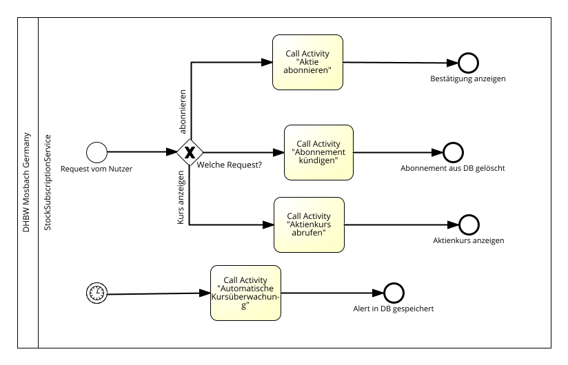

Das Diagramm zum Gesamtprozess zeigt die übergeordnete Struktur des StockSubscriptionService und dient als Einstieg in die verschiedenen Teilprozesse der Anwendung. Der Prozess kann durch zwei unterschiedliche Ereignisse gestartet werden. Zum einen kann ein Nutzer über die Benutzeroberfläche eine Anfrage an den Service stellen, zum anderen kann der Prozess durch ein zeitgesteuertes Ereignis ausgelöst werden, welches die automatische Kursüberwachung startet.

Wenn eine Anfrage von einem Nutzer eingeht, wird zunächst über ein Gateway entschieden, um welche Art von Anfrage es sich handelt. Der Nutzer kann entweder eine Aktie abonnieren oder den aktuellen Kurs einer Aktie abfragen. Abhängig von dieser Entscheidung wird eine entsprechende Call Activity aufgerufen, welche den jeweiligen Teilprozess startet. Beim Abonnieren einer Aktie wird der Prozess „Aktie abonnieren“ ausgeführt, während bei einer Kursabfrage der Prozess „Aktienkurs abrufen“ gestartet wird.

Zusätzlich existiert ein zeitgesteuerter Startpunkt für die automatische Kursüberwachung. Dieser wird regelmäßig durch einen Timer ausgelöst und startet den Prozess zur automatischen Überprüfung der Kurse aller abonnierten Aktien. Falls eine relevante Kursänderung festgestellt wird, kann anschließend eine Benachrichtigung erzeugt werden.

Das Diagramm zeigt somit die Rolle des StockSubscriptionService als Composite Service, der mehrere spezialisierte Teilprozesse orchestriert und diese abhängig von Benutzeranfragen oder zeitgesteuerten Ereignissen aufruft.

## Hilfsprozess: Aktienkursabfrage

 

 

Der Prozess „Aktienkurs abrufen“ ist ein unterstützender Teilprozess innerhalb des StockSubscriptionService. Er wird nicht direkt durch eine Benutzeranfrage gestartet, sondern von anderen Prozessen aufgerufen, wenn aktuelle Kursinformationen benötigt werden. Dazu gehören beispielsweise der Prozess zur automatischen Kursüberwachung oder andere Funktionen, die den aktuellen Wert einer Aktie benötigen.

Der Prozess beginnt mit der Übergabe eines Aktiensymbols durch den aufrufenden Prozess. Dieses Symbol identifiziert eindeutig die Aktie, deren aktueller Kurs abgefragt werden soll. Anschließend wird der externe StockService aufgerufen, der aktuelle Marktdaten zu der angegebenen Aktie bereitstellt. Der Service liefert dabei den aktuellen Preis der Aktie in einer festgelegten Basiswährung, typischerweise US-Dollar.

Falls es keinen Fehler gab, wird der berechnete Kurswert wird anschließend an den aufrufenden Prozess zurückgegeben. Dieser kann die Daten anschließend weiterverarbeiten, beispielsweise für eine Kursanzeige oder für die Überprüfung von Kursänderungen im Rahmen der automatischen Benachrichtigungslogik. Damit stellt der Prozess eine zentrale Funktion zur Bereitstellung aktueller Kursinformationen innerhalb des Gesamtsystems dar.

HHTP-Nachricht:

Abfrage Aktienkurs:
 
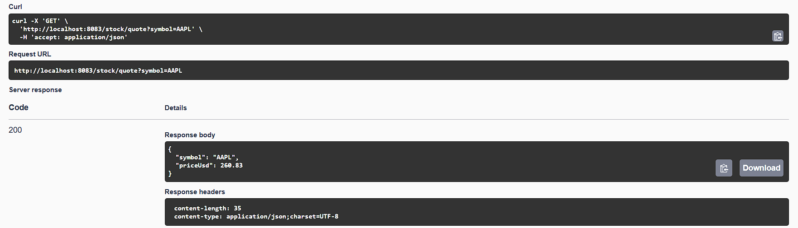
 

## Prozess: Aktie abonnieren

---

 

 

Der Prozess „Aktie abonnieren“ beschreibt, wie ein Nutzer eine bestimmte Aktie zu seiner persönlichen Beobachtungsliste hinzufügen kann. Der Prozess beginnt mit einer Anfrage des Nutzers, in der dieser den Namen oder das Symbol der gewünschten Aktie angibt.

Zunächst wird die Anfrage vom StockSubscriptionService entgegengenommen und validiert. Dabei wird geprüft, ob die eingegebene Aktie existiert und ob die Anfrage korrekt aufgebaut ist. Um diese Information zu erhalten, wird der externe StockService aufgerufen, der aktuelle Informationen zur angegebenen Aktie liefert. Dieser Schritt stellt sicher, dass nur gültige Aktien in das System aufgenommen werden.

Anschließend wird über ein Gateway überprüft, ob der Nutzer die Aktie bereits abonniert hat. Falls die Aktie bereits vorhanden ist, wird keine neue Speicherung vorgenommen und der Prozess kann direkt beendet werden. Falls die Aktie noch nicht abonniert wurde, wird ein Eintrag im SubscriptionService erzeugt. Dieser speichert die Verbindung zwischen Nutzer und Aktie, sodass diese später für Kursabfragen oder automatische Überwachung verwendet werden kann.

Nach erfolgreicher Speicherung wird eine Bestätigung erzeugt und an den Nutzer zurückgegeben. Damit ist der Abonnementprozess abgeschlossen. Der Nutzer kann nun zukünftig Kursinformationen zu dieser Aktie abrufen oder automatisch über relevante Kursänderungen informiert werden.

HTTP-Nachrichten:

Aktien-Symbol suchen:

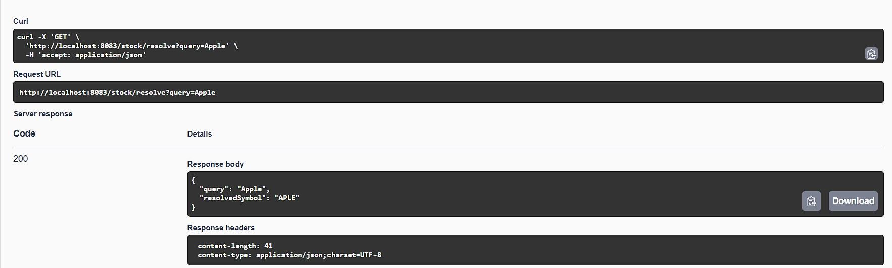

Abonnement in SubscriptionService speichern:

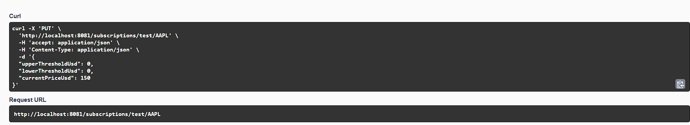

## Prozess: Automatische Kursüberwachung

---

 

 
Der Prozess der automatischen Kursüberwachung dient dazu, Kursänderungen bei abonnierten Aktien regelmäßig zu überprüfen und Nutzer gegebenenfalls zu benachrichtigen. Der Prozess wird nicht direkt von einem Nutzer gestartet, sondern durch ein Timer-Event, das in regelmäßigen Abständen ausgelöst wird.

Nach dem Start lädt der Prozess zunächst alle vorhandenen Abonnements aus dem SubscriptionService. Diese enthalten Informationen darüber, welche Nutzer welche Aktien beobachten. Anschließend wird iterativ über diese Abonnements gearbeitet.

Für jede abonnierte Aktie wird der aktuelle Kurs über den StockService abgefragt. Dieser Kurs wird anschließend mit dem zuletzt bekannten Kurswert verglichen. Falls eine signifikante Kursänderung festgestellt wird, wird der AlertService aufgerufen. Dieser erzeugt eine entsprechende Benachrichtigung für den betroffenen Nutzer und setzt das Limit, durch das der Alert ausgelöst wurde, zurück.

Wenn keine relevante Änderung vorliegt, wird keine Aktion ausgeführt und der Prozess fährt mit der nächsten Aktie fort. Nachdem alle Abonnements überprüft wurden, endet der Prozess. Durch diesen Mechanismus können Nutzer automatisch über wichtige Kursbewegungen informiert werden, ohne selbst aktiv eine Anfrage stellen zu müssen.

HTTP-Nachrichten:

Alle Nutzer ermitteln:

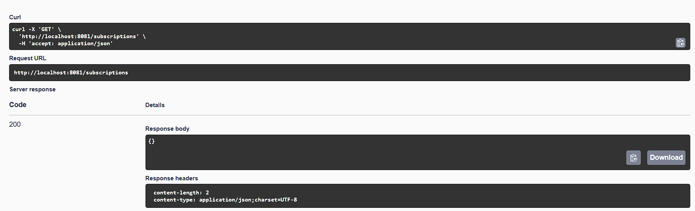

Abonnements für Nutzer erhalten:

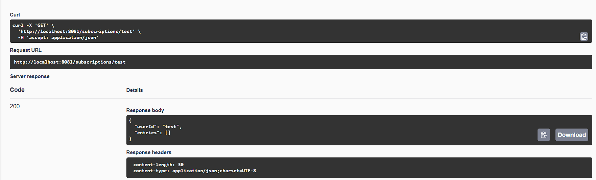

Prüfung auf über-/unterschreiten von Grenzen:

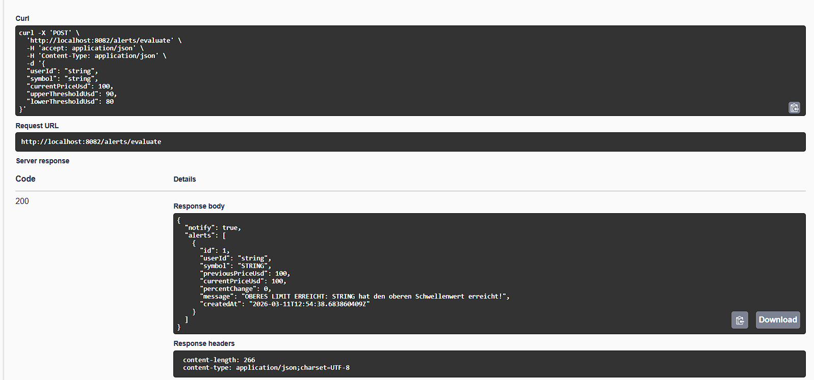

Ober-/Untergrenze ändern:

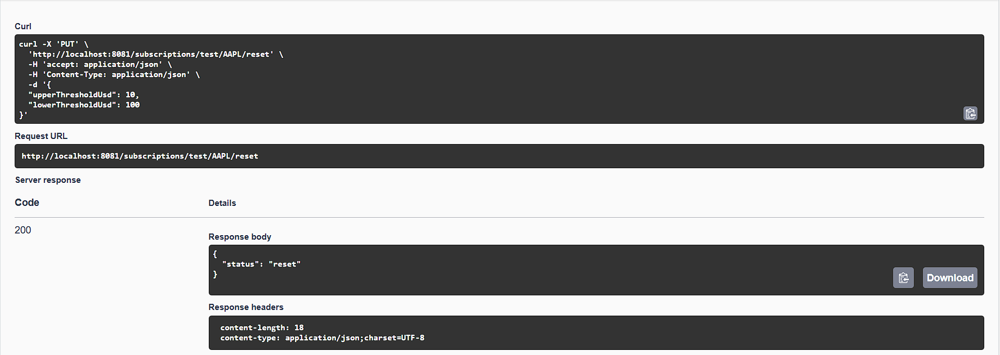

## Prozess: Wärungsumrechnung

---

 

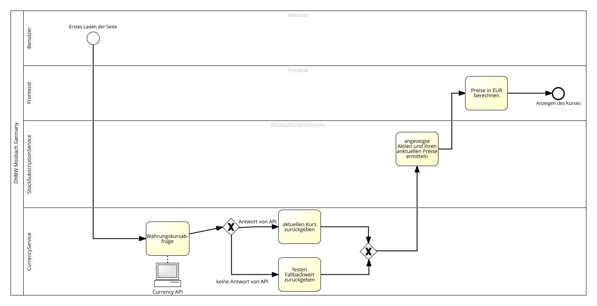

 

Der Prozess „Währungsumrechnung“ wird aufgerufen, wenn ein Aktienkurs nicht in der gewünschten Zielwährung vorliegt. Der Ablauf beginnt mit der Übergabe eines Betrags und der zugehörigen Ausgangswährung.

Zunächst wird der aktuelle Wechselkurs über einen externen CurrencyService abgefragt. Dieser liefert den Faktor, der benötigt wird, um den Betrag von der Ausgangswährung in die gewünschte Zielwährung zu konvertieren. Nachdem der Wechselkurs erhalten wurde, wird der Betrag entsprechend umgerechnet.

Der umgerechnete Wert wird anschließend an den aufrufenden Prozess zurückgegeben, beispielsweise an den Prozess zur Kursabfrage. Dadurch können Kursinformationen flexibel in verschiedenen Währungen dargestellt werden.

Durch die Nutzung eines externen Services bleibt der Prozess unabhängig von lokalen Wechselkursdaten und kann jederzeit aktuelle Umrechnungswerte verwenden.

HTTP-Nachricht: 

Währungsumrechnung:

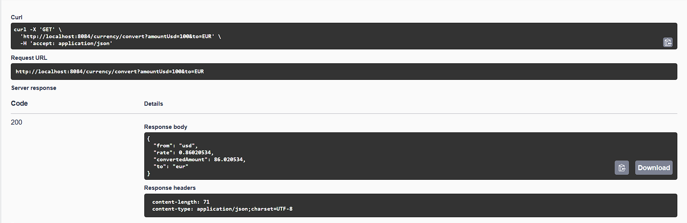

## Prozess: Abonnement kündigen

---

Der Prozess „Abonnement kündigen“ beschreibt, wie ein Nutzer eine zuvor abonnierte Aktie wieder aus seiner Beobachtungsliste entfernen kann. Der Ablauf beginnt mit einer Anfrage des Nutzers, in der die zu entfernende Aktie angegeben wird.

Nach Eingang der Anfrage wird zunächst überprüft, ob für den Nutzer tatsächlich ein entsprechendes Abonnement existiert. Dazu wird der SubscriptionService aufgerufen, der die gespeicherten Abonnements verwaltet. Falls kein passender Eintrag gefunden wird, kann der Prozess direkt beendet werden, da keine Änderung erforderlich ist.

Falls das Abonnement existiert, wird der entsprechende Eintrag aus der Datenstruktur entfernt. Anschließend wird der aktualisierte Zustand im System gespeichert. Durch diesen Schritt wird sichergestellt, dass die betreffende Aktie künftig nicht mehr im Rahmen der automatischen Kursüberwachung berücksichtigt wird.

Nach erfolgreicher Entfernung wird eine Bestätigung erzeugt und an den Nutzer zurückgegeben. Damit ist der Kündigungsprozess abgeschlossen.

HTTP-Nachrichten:

Abo aus SubscriptionService löschen:

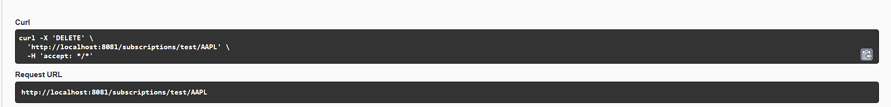

State für Aktie in AlertService löschen:

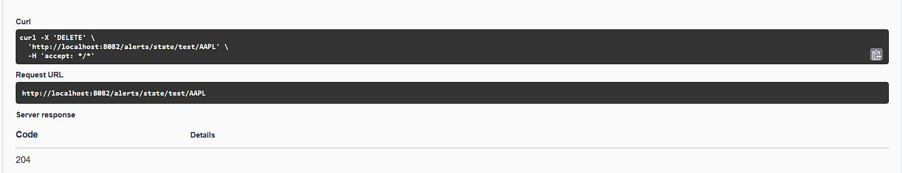

## Openapi-Dateien:

Die Openapi-Dateien sind außerhalb der Dokumentation in den folgenden Dateien zu finden:

* SubscriptionService: Openapi-SubscriptionService.txt
* AlertService: Openapi-AlertService.txt
* StockService: Openapi-StockService.txt
* CurrencyService: Openapi-CurrencyService.txt